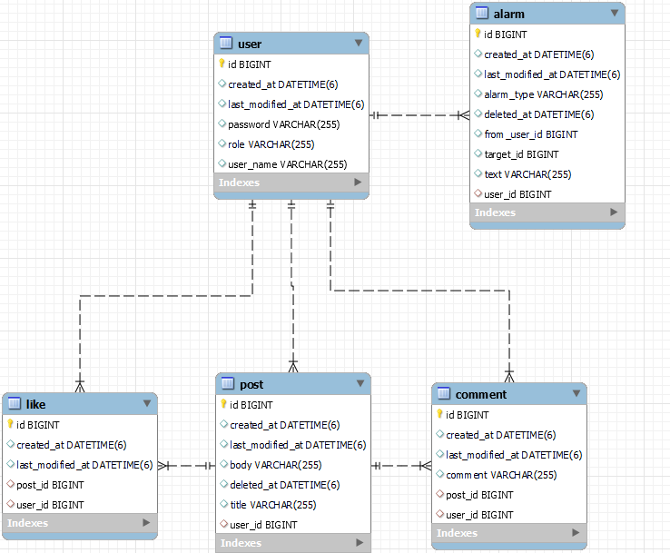

# MutsaSNS

## 미션 요구사항 분석 & 체크리스트
- SpringBoot + JPA + JWT 를 이용하여 트위터와 유사한 SNS 서비스를 만든다.

---
### 프로젝트 기술스택
- 에디터 : Intellij Ultimate
- 개발 툴 : SpringBoot 2.7.6
- 자바 : JAVA 11
- 빌드 : Gradle 6.8
- 서버 : AWS EC2
- 데이터베이스 : MySql 8.0
- 필수 라이브러리 : SpringBoot Web, MySQL, Spring Data JPA, Lombok, Spring Security, JWT, Swagger

---
### 필수과제(11/11)

- [x] 회원가입
- [x] Swagger
- [x] AWS EC2에 Docker 배포
- [x] Gitlab CI & Crontab CD
- [x] 로그인
- [x] 포스트 작성, 수정, 삭제, 리스트
- [x] 댓글
- [x] 좋아요
- [x] 마이피드
- [x] 알림
- [x] Swagger에 ApiOperation을 써서 Controller 설명 보이게 할 것

---
### API DOCS
| 구분  | Method | URI                           | Description          | 참고                           |
|-----|--------|-------------------------------|----------------------|------------------------------|
| 회원  | POST   | /users/join                   | 회원가입                 | 아이디 중복 불가능                   | 
|     | POST   | /users/login                  | 로그인                  | 로그인 시 JWT 발급                 | 
|     | POST   | /users/{id}/role/change       | 권한 변경(ADMIN->USER 변경) | ADMIN 권한만 접근 가능              | 
| 포스트 | GET    | /posts                        | 전체 포스트 리스트 조회        | Paging(최신순,20개씩)             | 
|     | GET    | /posts/{id}                   | 단일 포스트 조회            |                              | 
|     | POST   | /posts                        | 포스트 작성               | 로그인 후 이용가능                   |
|     | PUT    | /posts/{id}                   | 포스트 수정               | 본인 또는 ADMIN 권한 필요            | 
|     | DELETE | /posts/{id}                   | 포스트 삭제               | 본인 또는 ADMIN 권한 필요            | 
|     | GET    | /posts/my                     | 마이피드 조회              | 본인이 작성한 글만 조회                | 
| 댓글  | GET    | /posts/{postId}/comments      | 댓글 조회                | Paging(최신순,10개씩)             | 
|     | POST   | /posts/{postId}/comments      | 댓글 등록                | 로그인 후 이용가능                   | 
|     | PUT    | /posts/{postId}/comments/{id} | 댓글 수정                | 본인 권한 필요                     |
|     | DELETE | /posts/{postId}/comments/{id} | 댓글 삭제                | 본인 권한 필요                     |
| 좋아요 | GET    | /posts/{postId}/likes         | 좋아요 조회               | 해당 게시글의 좋아요 갯수 조회            | 
|     | POST   | /posts/{postId}/likes         | 좋아요 누르기              | 게시글에 좋아요 등록, 한번 더 호출시 좋아요 취소 |
| 알람  | GET    | /alarms                       | 알람 조회                | 사용자의 게시글에 좋아요, 댓글이 달리면 알람 등록 |

### ERROR CODE
| 에러 코드                | 설명                                                                 | HTTP status |
|----------------------|--------------------------------------------------------------------|-------------|
| DUPLICATED_USER_NAME | 중복된 아이디로 가입을 요청한 경우                             | 409         |
| USERNAME_NOT_FOUND   | 가입되지 않은 아이디로 요청한 경우                                                | 404         |
| INVALID_PASSWORD     | 비밀번호가 틀린 경우                                                        | 401         |
| INVALID_TOKEN        | 유효하지 않은 토큰으로 요청한 경우                                                | 401         |
| INVALID_PERMISSION   | 해당 API에 대한 요청 권한이 없는 경우,  올바르지 않은 헤더로 요청한 경우,  게시글에 대한 수정/삭제 권한이 없는 경우 | 401         |
| POST_NOT_FOUND       | 존재하지 않는 게시물을 요청한 경우                                                | 404         |
| COMMENT_NOT_FOUND    | 존재하지 않는 댓글을 요청한 경우                                                 | 404         |
| DATABASE_ERROR       | DB와의 연결 이상인 경우                                                     | 500         |

---
## URL
http://ec2-13-124-16-45.ap-northeast-2.compute.amazonaws.com:8080/

## ERD

